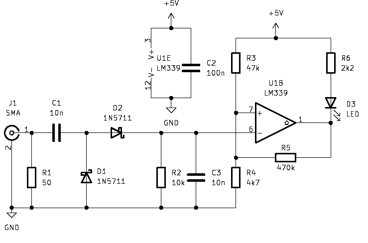
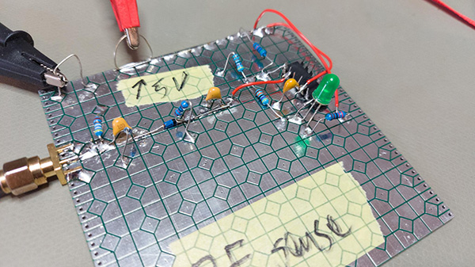

As part of another circuit I'm trying to design, I would like to have a
high impedance detection of whether there is RF on the wire (this would
be for a lab 10MHz distribution amp). I believe the following circuit 
should do: 

{width=600px}

After the 50-ohm load (for the experiment, not for the final design, just
to terminate the signal generator in the testing), there are two 
Schottky diodes to rectify the signal, and then (R2,C3) filter the output
into the comparator negative input. If we start from a low RF level state, 
the rectified RF is compared to a voltage of 
$4.7/(4.7+47) \cdot 5V = 0.45V$.  That corresponds to around 3 dBm.  

When the RF is lower, the positive input is higher, and the comparator
lets its output go high, and there is no voltage to light the LED. 
But when the rectified RF goes above 3 dBm, the comparator opens
the collector, and there is sufficient voltage to light the LED. Now
R5 is also almost paralleled with R4, pulling the positive reference input
towards ground (except for $V_{CE}$ of the output transistor of the comparator).
That provides some hysteresis in the detection of RF by the LED. 

I built the circuit on one of the prototyping boards I had JLCPCB made from 
the Gerber files that 
[Ryan Flower, W7RLF, have made available](https://miscdotgeek.com/a-new-prototyping-pcb-for-qrp-homebrew-radio/):

{width=600px}

All the diamond shapes on the board are connected to a ground plane on the back
side of the board. The LM339 (the only comparator I had around in a DIP package)
is superglued dead-bug style to the board. After fixing a bad solder joint, 
I could make the following measurements, using my HP signal generator for 
fine power adjustments:

```{r echo=FALSE, message=FALSE, warning=FALSE}
library(tidyverse)
library(gt)
mdf <- tribble(~`Frequency (MHz)`, ~`Turn on (dBm)`, ~`Turn off (dBm)`,
               1, 3.1, 2.7,
               5, 3.4, 3.0,
               10, 3.4, 3.0,
               20, 3.6, 3.1,
               30, 4.2, 3.8)
mdf %>% gt
```

So this is more or less as the calculations implied, so this must count 
as some success. There seems to be some additional attenuation at higher
frequencies, with higher power needed to turn the LED on.
I measure the relevant voltages to see if my hypotheses were correct:

- When the RF on LED lights up, I measure 1.89V over the green LED (I should
put a smaller resistance to get a bit more light from this). There are 3V over
the resistor R6, and only 75 mV at the comparator output. The reference
voltage at the +IN pin of the comparator measures 448 mV. 
- When the RF on LED turns off, I measure 3.32V at the comparator output, and 477
mV at +IN.


