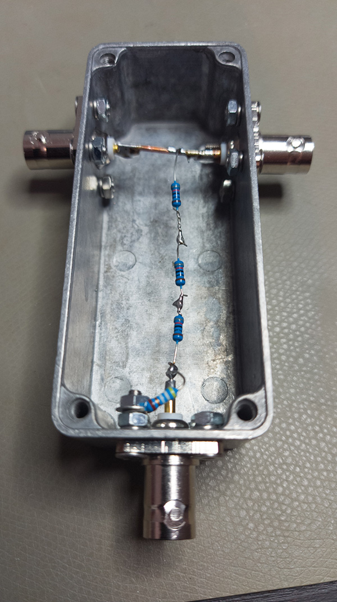

I have thought about what I need to do to monitor my own transmission on 
an oscilloscope - or possibly a spectrum analyzer; also it would be nice to
have the possibility of measuring power without having to rely on a lot
of my own circuitry working correctly. So I decided to build a resistive 
RF power tap. Wes Hayward, W7ZOI, and Bob Larkin, W7PUA, showed how to do
this in their original  paper on their AD8307 power meter (in QST, June 2001).


# Build

Hayward and Larkin's design is built into a die cast aluminium box with
connectors on three sides. I used the same type of box (sourced from ebay),
and put BNC connectors (with flanges) on.  I have built a version aiming
for 40 dB attenuation, as in this picture:

{width=600px}

There are two weaknesses with this current version. First, the resistors
cannot withstand a lot of power, so this is a proof of concept. If there
are 100W in the through line, there will be almost 2W divided on the 3
820 ohm resistors going down from the line. I should order some resistors
that are more beefy. Second, I haven't installed a metal plate as the through
connection. Hayward and Larkin used a brass plate to connect through
from the input to the output, which I guess would balance the inductance
in the through connection with capacitive coupling to ground (they also used
a short wire stub in parallel with the resistors). I tried fabricating
such a plate out of a sardine tin, but I suspect that was made out of aluminium
and it wouldn't solder. I tried to make one out of scap pcb material, but
that seemed very stiff and a mechanical problem without more support. So I decided
to see how it would work with low power and without any attempt at high frequency 
compensation. 


# Return loss at input port (S11)

I terminated the output and the sample tap in 50 ohm dummy loads, and put the
nanoVNA on the input point. I used my fancy Mini-Circuit 50 ohm terminator on
the output and calibrated the nanoVNA for a sweep 1-500 MHz. 


```{r echo=FALSE, message=FALSE, warning=FALSE}
library(tidyverse)
df <- tribble(~frequency, ~return_loss,
              1, -42.14,
              6, -40.86,
              11, -38.94,
              16, -37.11,
              21, -35.3,
              26, -33.8,
              31, -32.51,
              36, -31.45,
              41, -30.47,
              46, -29.65,
              51, -28.95,
              71, -26.35,
              100.8, -22.97,
              145.71, -19.3,
              200.6, -16.26,
              300.4, -13.33,
              400.2, -12.67,
              500, -11.3)

df %>% ggplot(aes(x=frequency, y=return_loss)) +
  geom_line() +
  geom_point() + 
  theme_minimal() +
  labs(x = "Frequency [MHz]",
       y = "Return loss [dB]", 
       title = "Performance of RF tap (return loss)") +
  theme(plot.title.position = "plot")
```

Examination of the Smith chart on the NanoVNA confirms that the all complex
impedance is on the inductive side, indicating that it is the lack of capacitance
in my build that is a problem at higher frequencies. Still, the return loss
at 145 MHz is 19 dB, making it useful also at VHF. Hardware tweaking can perhaps
make it acceptable also at the lower UHF frequencies. I'll get back to it when
I have received some beefier 820 ohm resistors for a permanent build.

# Attenuation (S21)

I reconfigured the testing setup: Kept the 50 ohm termination on the output,
but connected the NanoVNA for a two port measurement - from the input port
to the tap (the attenuated output). I recorded the 

```{r echo=FALSE, message=FALSE, warning=FALSE}
df2 <- tribble(~frequency, ~attenuation,
               1, -39.51,
               6, -39.54,
               11, -39.57,
               16, -39.53,
               51, -39.52,
               145, -39.6,
               230, -40.04,
               400.2, -41.5,
               500, -42.5)
df2 %>% ggplot(aes(x=frequency, y=attenuation)) +
  geom_line() +
  geom_point() + 
  theme_minimal() +
  labs(x = "Frequency [MHz]",
       y = "Attenuation [dB]", 
       title = "Performance of RF tap (attenuation)") +
  theme(plot.title.position = "plot")             
```

Attenuation is very close to the nominal 40dB.
This curve looks dramatic, but considering the scale, attenuation is
flat up to and including VHF, only drops off by a couple
of dB at 500 MHz. 

# Conclusion

Fancy high frequency corrections would be nice, but is not strictly necessary
for operation at the 144 MHz band and lower. Mouser sells 820 Ohm resistors, 2W for
about 10kr a piece. I would need 3 of these - I have 50 Ohm terminating resistors,
and this doesn't have to drop as much power.


