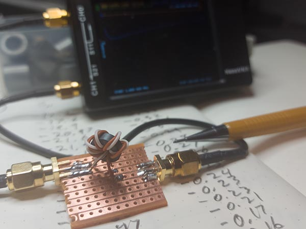

```{r message=FALSE, warning=FALSE, include=FALSE}
library(tidyverse)
```

I've been thinking about an application where I want to provide 
transformer-isolated outputs (a 10MHz reference distribution amplifier). 
But I really find working with enamel coated ("magnet") wire hard - stripping
the enamel to solder to the wire is hard, and it is hard to keep track of
which wire ends belong together. So I thought, I have a spool of single strand
CAT-5 wire for installation, what if I used a twisted pair to wind the transformer?
I probably couldn't get as many turns on to a small core, but I decided to try.
I managed to put 6 turns onto a T37-43 core, and soldered it to a small
stripboard fixture with SMA edge-mount connectors: 

{width=600px}

This is not the prettiest of transformers, and it is large compared to what
is commercially available (such as the [Mini-Circuits ADT1-1+](https://www.minicircuits.com/pdfs/ADT1-1+.pdf)). 

I used to nanoVNA to measure the return loss and the attenuation of this transformer
over 1 to 100 MHz (but I'm most interested in what happens around 10MHz). 

```{r echo=FALSE, message=FALSE, warning=FALSE}
mdf <- tribble(~frequency, ~S11, ~S21,
               1, -12.2, -0.42,
               2, -17.6, -0.33,
               3, -19.9, -0.33,
               4, -20.97, -0.32,
               5, -21.6, -0.31,
               6, -21.96, -0.3,
               7, -22.16, -0.29,
               8, -22.25, -0.28,
               9, -22.26, -0.27,
               10, -22.21, -0.26,
               11, -22.12, -0.25,
               12, -21.99, -0.25,
               13, -21.83, -0.24,
               14, -21.66, -0.23,
               15, -21.47, -0.23,
               20, -20.41, -0.21,
               30, -18.32, -0.17,
               40, -16.6, -0.16, 
               50, -15.20, -0.18,
               70, -13.32, -0.41,
               90, -12.43, -0.60,
               100, -14.32, -0.71)

mdf %>% pivot_longer(c(S11,S21), names_to = "S-parameter", values_to = "sparam") %>%
  ggplot(aes(x=frequency, y=sparam, color=`S-parameter`)) +
  geom_line() +
  theme_minimal() +
  labs(x = "Frequency [MHz]",
       y = "S-parameter [dB]",
       title = "Measurements on T37-43 1:1 transformer") +
  theme(plot.title.position = "plot")
```


Looking at the graph, we see that from 3-4 MHz, the return loss is above 20 dB,
and it stays below 15 dB until 50 MHz. The insertion loss is minimal throughout
the this range. For my use case, 10 MHz, I measure the return loss to be 22.2 dB,
and the insertion loss to be 0.26 dB. This is not much worse than the 
Mini-Circuits part I referenced above (which has other nice features).

I conclude that transformers of this type, even with only 6 turns, 
will work just fine for the output of a 10 MHz distribution amplifier. Note to
self: I really should get the serial interface to the nanoVNA working such
that I don't have to punch the numbers myself.
