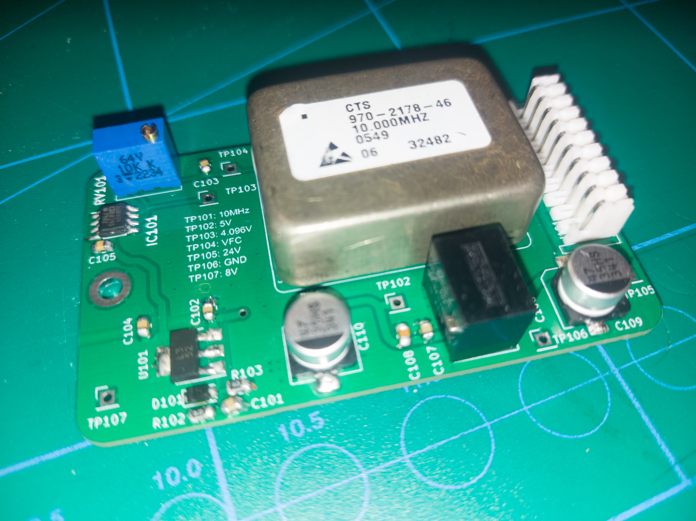

```{r setup, include=FALSE}
knitr::opts_chunk$set(echo = TRUE)
library(tidyverse)
library(scales)
```

See (https://github.com/ErikOSorensen/PM66xx-frequency-reference/tree/main) for the design.

{width=800px}

# Current drawn

From an ambient temperature, I measured how much current the oscillator
drew from the power supply in the first minutes (at 5V). I measured
the current draw every 10th second.

```{r include=FALSE}
is <- c(0.620, 0.623, 0.623, 0.623, 0.623, 0.620, 
        0.622, 0.622, 0.621, 0.413, 0.364, 0.344,
        0.333, 0.323, 0.316, 0.310, 0.303, 0.298,
        0.293, 0.291, 0.285, 0.290, 0.292, 0.292,
        0.292, 0.290) * 1000
start <- as_datetime("2023-12-20T204800")
second <- as_datetime("2023-12-20T204810")                
ts <- seq(start, by=difftime(second,start),length.out=26)
df <- tibble(current=is, time=ts)
```

```{r echo=FALSE}
df |> ggplot(aes(x=time, y=current)) +
  geom_line() +
  theme_minimal() +
  labs(x = "Measurement moment", y = "Current draw [mA]",
       title="The oscillator warming up") +
  theme(plot.title.position = "plot")
```

Very slowly, the current draw continued to drop, at 22:20 the current drawn was 236 mA.

# Frequency vs control voltage

If the frequency generated cannot be controlled in a proper window around 10MHz,
the oscillator might be too old and for use. I measured the frequency
generated for some control voltages, and this doesn't seem like a problem.

```{r echo=FALSE}
df2 <- tibble(V_control = c(2.000, 2.100, 2.200, 2.300, 2.400),
              f_out = c(9999999.1, 9999999.490, 9999999.965, 10000000.246, 10000000.621))
df2 |> ggplot(aes(x=V_control, y=f_out)) +
  geom_line() +
  geom_point() + 
  theme_minimal() +
  scale_y_continuous(labels = scales::label_comma()) +
  labs(x="Control voltage [V]", y = "Frequency [Hz]", 
       title="Frequency vs control voltage") +
  theme(plot.title.position = "plot")
dlta <- (max(df2$f_out) - min(df2$f_out))/(max(df2$V_control)-min(df2$V_control))
```

The frequency was measured by my Agilent 53131A with a GPSDO reference
(with a 1s gate time). This seems fairly linear, with about
`r format(dlta, digits=2)`
Hz/V. The potentiometer on the board has 4.096V from the voltage reference 
over 23 turns, so this will give about `r format(dlta * 4.096 /23, digits=2)` 
Hz/turn which should make it possible to  calibrate it fairly precisely.


# Amplitude

Running freely, without a load, I measured 2.3V peak-to-peak. With the filtration
and the 50 Ohm on-board load resistor that I have adopted from previous designs I measure
around 1V peak-to-peak, which is more or less in line with a 50 Ohm internal
impedance of the oscillator, and a small insertion loss of the low pass filter
I added.


