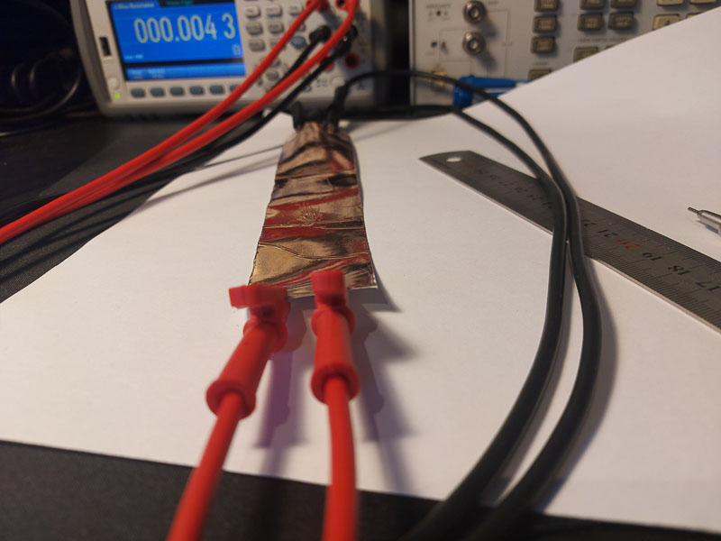
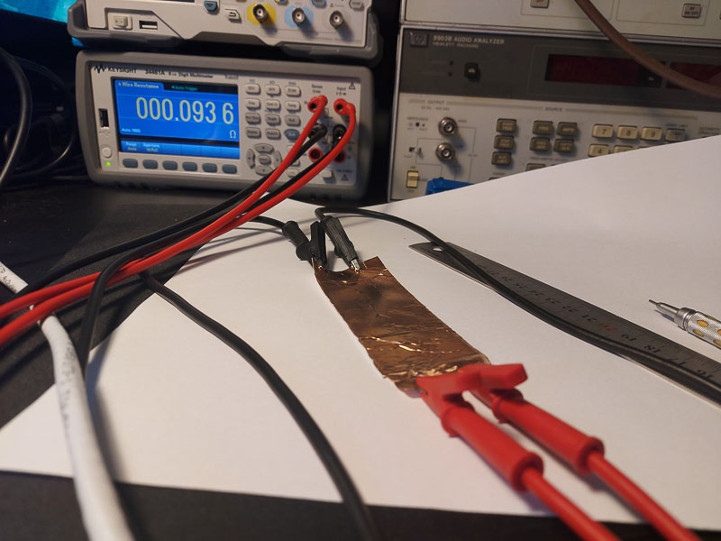

Copper tape has been suggested as a material for [creating
antennas](https://youtu.be/hpDNbAbOjJY?si=gezv4ha40Ch_zPYa) and RF-shielding plastic boxes. Copper tape can be bought where
garden supplies can be found, apparently  slugs and snails find it difficult to walk across it. 
Not all copper tape has electrically conducting adhesives. If the
adhesive layer is sufficiently thin, I'm not sure that this would make
a large difference at RF, since I guess there will be plenty of capacitive 
coupling. But a conductive adhesive can only improve shielding or antenna performance. 
The copper tape sold at "Clas Ohlson" is explicitly sold as having
non-conductive adhesive. The tape at Biltema comes with no information 
about the conductivity of the adhesive. I bought
a roll to experiment (89 kr/roll).

The Biltema copper tape [(article no. 29-2506)](https://www.biltema.no/fritid/hage/planting/plantekasser-og-tilbehor/kobbertape-2000039666) is 40mm wide and comes in a roll of 5m. 
I cut a 20 cm strip and measured 4.3 mOhm using  Kelvin connections. 

I then cut the 20cm strip into two strips of 10cm, and pasted them on top of each other (with 9 cm overlap). I measured the resistance 
between the top and the bottom strip to be 94 mOhm.

.

I conclude that the adhesive on the copper tape is sufficently conductive for 
most purposes.

